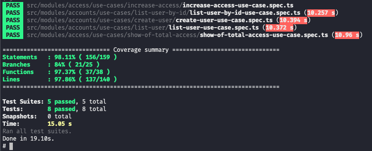

# **Ton Challenge**

O projeto consiste na criação de usuários, e um sistema de controle de quantidade de acessos de um site.

Principios/Técnicas/Conceitos utilizados:
- **Clean Architecture (CA)**
- **Domain-Driven Design (DDD)**
- **SOLID**
- **Design Patterns**
- **Keep It Simple, Stupid (KISS)**
- **Don't Repeat Yourself (DRY)**


## **Instruções de instalação**

### Começando

#### 1) Clone & Instalar Dependências

- 1.1) `git clone https://github.com/ricardoSpara/ton-challenge.git`
- 1.2) `cd ton-challenge` - cd em seu diretório de projeto recém-criado
- 1.3) `cp .env.development.example .env` - copiar variáveis ​​de ambiente.
  **Note:** verifique as variáveis ​​de ambiente de acordo com suas configurações locais (no .example está de acordo com docker-composer já)

#### 2) Inicie a aplicação

- 2.1) **[Docker]** Se você tiver uma docker em sua máquina:
  - 2.1.1) Local Deploy: `docker-compose up`


## **Aplicação**

### Rotas

Foi utilizado swagger para documentar as rotas da aplicação, verifique `http://localhost:3000/api-docs/`


## **Testes**

Os teste utilizam jest, foquei os testes principalmente na parte de caso de uso, onde ficam todas as implementações. Automaticamente já é gerado a pasta coverge para verificar quais pontos do sistemas estão testados.

### Rodar

```bash
yarn test # or npm run test
```


